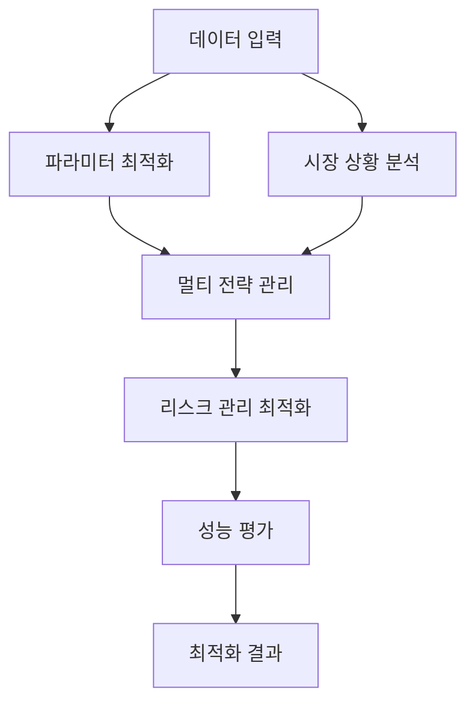

# Lesson 13: 자동매매 전략 최적화 시스템

## 📋 목차
1. [개요](#개요)
2. [시스템 아키텍처](#시스템-아키텍처)
3. [설치 방법](#설치-방법)
4. [핵심 모듈](#핵심-모듈)
5. [사용 방법](#사용-방법)
6. [최적화 방법](#최적화-방법)
7. [성능 지표](#성능-지표)
8. [예제 코드](#예제-코드)
9. [문제 해결](#문제-해결)

---

## 📖 개요

자동매매 전략의 성능을 최적화하는 포괄적인 시스템입니다. 파라미터 최적화, 멀티 전략 관리, 시장 상황 분석, 리스크 관리 최적화, 성능 평가 기능을 제공합니다.

### 주요 목표
- **수익률 최대화**: 월간 목표 수익률 8% 이상
- **리스크 최소화**: 최대 낙폭(MDD) 10% 이하
- **안정성 향상**: 승률 70% 이상, 샤프 비율 1.5 이상

### 현재 성능 vs 목표 성능

| 지표 | 현재 | 목표 | 개선 목표 |
|------|------|------|-----------|
| 월간 수익률 | 5% | 8% 이상 | +60% |
| 최대 낙폭 | 15% | 10% 이하 | -33% |
| 승률 | 60% | 70% 이상 | +17% |
| 샤프 비율 | 1.2 | 1.5 이상 | +25% |

---

## 🏗️ 시스템 아키텍처

```
lesson-13/
├── src/
│   └── optimization/
│       ├── __init__.py                          # 모듈 초기화
│       ├── parameter_optimizer.py               # 파라미터 최적화 엔진
│       ├── multi_strategy_manager.py            # 멀티 전략 관리
│       ├── market_condition_analyzer.py         # 시장 상황 분석
│       ├── risk_optimizer.py                    # 리스크 관리 최적화
│       └── performance_evaluator.py             # 성능 평가 시스템
├── lesson-13-prompts.md                         # 개발 가이드
└── README.md                                    # 이 문서
```

### 핵심 컴포넌트



---

## 🔧 설치 방법

### 1. Python 가상환경 설정

```bash
# Windows
python -m venv bot-env
bot-env\Scripts\activate

# macOS/Linux
python3 -m venv bot-env
source bot-env/bin/activate
```

### 2. 필수 패키지 설치

```bash
# 기본 패키지
pip install pandas numpy scipy scikit-learn

# 최적화 라이브러리
pip install bayesian-optimization hyperopt optuna

# 시각화
pip install matplotlib plotly seaborn

# 데이터 처리 및 기술적 지표
pip install PyWavelets ta

# 성능 분석 (quantstats 사용 - empyrical/pyfolio는 Python 3.8+에서 호환 문제)
pip install quantstats

# 유틸리티
pip install pyyaml python-dotenv tqdm joblib statsmodels
```

### 3. 필수 패키지 목록 (requirements.txt)

```bash
pip install -r requirements.txt
```

**requirements.txt 주요 패키지:**
```
pandas>=1.5.0
numpy>=1.23.0
scipy>=1.9.0
scikit-learn>=1.1.0
bayesian-optimization>=1.4.0
hyperopt>=0.2.7
optuna>=3.0.0
matplotlib>=3.6.0
plotly>=5.11.0
seaborn>=0.12.0
ta>=0.10.0  # 기술적 지표 (순수 Python)
PyWavelets>=1.4.1
quantstats>=0.0.62
statsmodels>=0.13.5
pyyaml>=6.0
python-dotenv>=0.21.0
tqdm>=4.64.0
joblib>=1.2.0
```

**참고:** 
- `ta` 라이브러리는 순수 Python으로 작성되어 설치가 쉽습니다
- TA-Lib(C 라이브러리)는 선택사항이며, `ta` 라이브러리로 대체 가능합니다

---

## 🎯 핵심 모듈

### 1. **Parameter Optimizer (파라미터 최적화)**

전략의 핵심 파라미터를 자동으로 최적화합니다.

**주요 기능:**
- ✅ Grid Search (격자 탐색)
- ✅ Genetic Algorithm (유전 알고리즘)
- ✅ Bayesian Optimization (베이지안 최적화)
- ✅ Adaptive Optimization (적응형 최적화)

**최적화 대상 파라미터:**
- 변동성 돌파 전략 k값 (0.2 ~ 1.0)
- 이동평균 기간 (단기: 3~15, 장기: 15~50)
- 손절/익절 비율 (손절: 0.5%~5%, 익절: 1%~10%)
- 포지션 크기 (2%~15%)

### 2. **Multi Strategy Manager (멀티 전략 관리)**

여러 전략을 조합하고 최적의 가중치를 할당합니다.

**주요 기능:**
- ✅ 전략 조합 최적화
- ✅ 동적 가중치 할당
- ✅ 상황별 전략 전환
- ✅ 포트폴리오 밸런싱

**지원 전략:**
- Volatility Breakout (변동성 돌파)
- MA Crossover (이동평균 교차)
- RSI Strategy (RSI 전략)
- Bollinger Bands (볼린저 밴드)

### 3. **Market Condition Analyzer (시장 상황 분석)**

시장 상황을 실시간으로 분석하고 최적 전략을 제안합니다.

**주요 기능:**
- ✅ 시장 체제 분석 (상승/하락/횡보)
- ✅ 변동성 구간 분석 (저/중/고)
- ✅ 트렌드 강도 측정
- ✅ 시간대별 패턴 분석

**분석 지표:**
- Market Regime (시장 체제)
- Volatility Regime (변동성 체제)
- Trend Strength (트렌드 강도)
- Time-based Patterns (시간대별 패턴)

### 4. **Risk Optimizer (리스크 관리 최적화)**

리스크를 최소화하고 안정적인 수익을 보장합니다.

**주요 기능:**
- ✅ 포지션 사이징 최적화
- ✅ 손실 한계 관리
- ✅ 상관관계 분석
- ✅ 리스크 메트릭 모니터링

**리스크 관리 방법:**
- Kelly Criterion (켈리 기준)
- Equal Weight (동일 가중)
- Risk Parity (리스크 패리티)
- Volatility Target (변동성 타겟)

### 5. **Performance Evaluator (성능 평가)**

전략의 성능을 다각도로 평가합니다.

**주요 기능:**
- ✅ 백테스트 실행
- ✅ 통계적 유의성 검정
- ✅ 리스크 조정 성과 분석
- ✅ 안정성 테스트

**평가 지표:**
- Return Metrics (수익률)
- Risk Metrics (리스크)
- Efficiency Ratios (효율성)
- Stability Indicators (안정성)

---

## 💡 사용 방법

### 기본 사용 예제

#### 1. 파라미터 최적화

```python
from src.optimization import ParameterOptimizer, OptimizationMethod, StrategyConfig
import pandas as pd

# 1. 데이터 준비
data = pd.read_csv('bitcoin_price_data.csv', parse_dates=['timestamp'])

# 2. 설정 생성
config = StrategyConfig(
    initial_capital=1_000_000,
    commission_rate=0.0005,
    slippage_rate=0.0001,
    max_position_size=0.1
)

# 3. 최적화 엔진 생성
optimizer = ParameterOptimizer(config)

# 4. 변동성 돌파 전략 최적화 (Grid Search)
result = optimizer.optimize_volatility_breakout_strategy(
    data=data,
    method=OptimizationMethod.GRID_SEARCH,
    cv_folds=5
)

# 5. 결과 출력
print(f"최적 파라미터: {result.best_parameters}")
print(f"최고 점수: {result.best_score:.2%}")
print(f"최적화 시간: {result.optimization_time:.2f}초")
```

#### 2. 멀티 전략 관리

```python
from src.optimization import MultiStrategyManager, StrategyType, WeightAllocationMethod

# 1. 멀티 전략 관리자 생성
manager = MultiStrategyManager(
    initial_capital=1_000_000,
    commission_rate=0.0005
)

# 2. 전략 추가
from src.optimization.multi_strategy_manager import StrategyConfig

vb_config = StrategyConfig(
    strategy_type=StrategyType.VOLATILITY_BREAKOUT,
    parameters={'k': 0.5, 'stop_loss': 0.02}
)
manager.add_strategy(strategy_id='vb_001', config=vb_config)

ma_config = StrategyConfig(
    strategy_type=StrategyType.MA_CROSSOVER,
    parameters={'short_period': 5, 'long_period': 20}
)
manager.add_strategy(strategy_id='ma_001', config=ma_config)

# 3. 가중치 할당
result = manager.optimize_weights(
    data=data,
    method=WeightAllocationMethod.RISK_PARITY,
    lookback_period=90
)

# 4. 백테스트 실행
backtest = manager.run_multi_strategy_backtest(
    data=data,
    rebalance_period=30
)

print(f"총 수익률: {backtest.total_return:.2%}")
print(f"샤프 비율: {backtest.sharpe_ratio:.2f}")
print(f"최대 낙폭: {backtest.max_drawdown:.2%}")
```

#### 3. 시장 상황 분석

```python
from src.optimization import MarketConditionAnalyzer

# 1. 분석기 생성
analyzer = MarketConditionAnalyzer()

# 2. 시장 상황 분석
conditions = analyzer.analyze_market_conditions(data)

if conditions:
    condition = conditions[-1]  # 최신 상황
    print(f"시장 체제: {condition.market_regime}")
    print(f"변동성 구간: {condition.volatility_regime}")
    print(f"트렌드 강도: {condition.trend_strength}")

# 3. 최적 전략 제안
signal = analyzer.generate_optimization_signal(data)

print(f"추천 전략: {signal.recommended_strategy}")
print(f"권장 파라미터: {signal.recommended_params}")
print(f"리스크 레벨: {signal.risk_level}")
```

#### 4. 리스크 최적화

```python
from src.optimization import RiskOptimizer, PositionSizingMethod
from src.optimization.risk_optimizer import RiskLimits

# 1. 리스크 한계 설정
limits = RiskLimits(
    max_position_size=0.15,
    daily_loss_limit=0.02,
    weekly_loss_limit=0.05,
    monthly_loss_limit=0.10
)

# 2. 리스크 최적화 생성
risk_optimizer = RiskOptimizer(
    initial_capital=1_000_000,
    risk_limits=limits
)

# 2. 포지션 크기 계산
expected_returns = {'KRW-BTC': 0.05, 'KRW-ETH': 0.04}
volatilities = {'KRW-BTC': 0.03, 'KRW-ETH': 0.04}
correlations = {('KRW-BTC', 'KRW-ETH'): 0.7}

positions = risk_optimizer.optimize_position_sizing(
    expected_returns=expected_returns,
    volatilities=volatilities,
    correlations=correlations,
    method=PositionSizingMethod.KELLY_CRITERION
)

for symbol, position in positions.items():
    print(f"{symbol}: 크기={position.size:.4f}, 금액={position.amount:,.0f}원")

# 3. 리스크 메트릭 계산
returns_data = {'KRW-BTC': btc_returns, 'KRW-ETH': eth_returns}
weights = {'KRW-BTC': 0.6, 'KRW-ETH': 0.4}

metrics = risk_optimizer.calculate_portfolio_risk_metrics(
    returns_data=returns_data,
    weights=weights
)

print(f"VaR (95%): {metrics.var_95:.2%}")
print(f"CVaR (95%): {metrics.cvar_95:.2%}")
print(f"최대 낙폭: {metrics.max_drawdown:.2%}")
```

#### 5. 성능 평가

```python
from src.optimization import PerformanceEvaluator, BacktestMethod

# 1. 평가기 생성
evaluator = PerformanceEvaluator()

# 2. 백테스트 실행
backtest_result = evaluator.run_backtest(
    strategy=my_strategy,
    data=data,
    method=BacktestMethod.WALK_FORWARD,
    train_period=180,
    test_period=30
)

# 3. 성능 메트릭 계산
metrics = evaluator.calculate_performance_metrics(
    trades=backtest_result.trades,
    equity_curve=backtest_result.equity_curve
)

print(f"총 수익률: {metrics.total_return:.2%}")
print(f"연간 수익률: {metrics.annual_return:.2%}")
print(f"샤프 비율: {metrics.sharpe_ratio:.2f}")
print(f"소르티노 비율: {metrics.sortino_ratio:.2f}")
print(f"최대 낙폭: {metrics.max_drawdown:.2%}")
print(f"승률: {metrics.win_rate:.2%}")

# 4. 통계적 유의성 검정
significance = evaluator.test_statistical_significance(
    strategy_returns=strategy_returns,
    benchmark_returns=benchmark_returns
)

print(f"t-통계량: {significance.t_statistic:.2f}")
print(f"p-값: {significance.p_value:.4f}")
print(f"통계적으로 유의함: {significance.is_significant}")
```

---

## 🚀 최적화 방법

### 1. Grid Search (격자 탐색)

**특징:**
- 모든 파라미터 조합을 체계적으로 탐색
- 최적해 보장 (정의된 범위 내)
- 계산 시간이 오래 걸림

**사용 예:**
```python
result = optimizer.optimize_volatility_breakout_strategy(
    data=data,
    method=OptimizationMethod.GRID_SEARCH
)
```

### 2. Genetic Algorithm (유전 알고리즘)

**특징:**
- 진화적 탐색으로 빠른 최적화
- 지역 최적해 탈출 가능
- 매개변수 튜닝 필요

**사용 예:**
```python
result = optimizer.optimize_volatility_breakout_strategy(
    data=data,
    method=OptimizationMethod.GENETIC_ALGORITHM
)
```

### 3. Bayesian Optimization (베이지안 최적화)

**특징:**
- 이전 결과를 활용한 효율적 탐색
- 적은 반복으로 좋은 결과
- 고차원 문제에 적합

**사용 예:**
```python
result = optimizer.optimize_volatility_breakout_strategy(
    data=data,
    method=OptimizationMethod.BAYESIAN_OPTIMIZATION
)
```

### 4. Adaptive Optimization (적응형 최적화)

**특징:**
- 시장 상황에 따른 동적 최적화
- 실시간 성능 모니터링
- 자동 재최적화

**사용 예:**
```python
result = optimizer.optimize_volatility_breakout_strategy(
    data=data,
    method=OptimizationMethod.ADAPTIVE_OPTIMIZATION
)
```

---

## 📊 성능 지표

### 수익률 지표

| 지표 | 설명 | 목표 |
|------|------|------|
| Total Return | 총 수익률 | > 30% (연간) |
| Annual Return | 연간 수익률 | > 8% (월간) |
| Monthly Return | 월간 수익률 | > 8% |
| Daily Return | 일간 수익률 | > 0.3% |

### 리스크 지표

| 지표 | 설명 | 목표 |
|------|------|------|
| Maximum Drawdown | 최대 낙폭 | < 10% |
| VaR (95%) | 위험가치 | < 3% |
| CVaR (95%) | 조건부 위험가치 | < 5% |
| Volatility | 변동성 | < 15% (연간) |

### 효율성 지표

| 지표 | 설명 | 목표 |
|------|------|------|
| Sharpe Ratio | 샤프 비율 | > 1.5 |
| Sortino Ratio | 소르티노 비율 | > 2.0 |
| Calmar Ratio | 칼마 비율 | > 3.0 |
| Information Ratio | 정보 비율 | > 1.0 |

### 안정성 지표

| 지표 | 설명 | 목표 |
|------|------|------|
| Win Rate | 승률 | > 70% |
| Profit Factor | 수익 팩터 | > 2.0 |
| Avg Win / Avg Loss | 평균 수익/손실 비율 | > 2.0 |
| Recovery Factor | 회복 팩터 | > 3.0 |

---

## 📝 예제 코드

### 전체 파이프라인 예제

```python
#!/usr/bin/env python3
# -*- coding: utf-8 -*-
"""
전략 최적화 전체 파이프라인
"""

import pandas as pd
import numpy as np
from datetime import datetime, timedelta
from src.optimization import (
    ParameterOptimizer,
    MultiStrategyManager,
    MarketConditionAnalyzer,
    RiskOptimizer,
    PerformanceEvaluator,
    OptimizationMethod,
    StrategyType,
    WeightAllocationMethod,
    PositionSizingMethod,
    BacktestMethod
)

def main():
    """메인 실행 함수"""
    
    # 1. 데이터 로드
    print("1. 데이터 로딩...")
    data = pd.read_csv('bitcoin_price_data.csv', parse_dates=['timestamp'])
    data.set_index('timestamp', inplace=True)
    
    # 2. 시장 상황 분석
    print("\n2. 시장 상황 분석...")
    analyzer = MarketConditionAnalyzer()
    conditions = analyzer.analyze_market_conditions(data)
    
    if conditions:
        condition = conditions[-1]
        print(f"  - 시장 체제: {condition.market_regime.value}")
        print(f"  - 변동성 구간: {condition.volatility_regime.value}")
        print(f"  - 트렌드 강도: {condition.trend_strength.value}")
    
    # 3. 파라미터 최적화
    print("\n3. 파라미터 최적화...")
    optimizer = ParameterOptimizer()
    
    # 변동성 돌파 전략 최적화
    vb_result = optimizer.optimize_volatility_breakout_strategy(
        data=data,
        method=OptimizationMethod.BAYESIAN_OPTIMIZATION,
        cv_folds=5
    )
    print(f"  - 변동성 돌파 최적 파라미터: {vb_result.best_parameters}")
    print(f"  - 최고 점수: {vb_result.best_score:.2%}")
    
    # 이동평균 전략 최적화
    ma_result = optimizer.optimize_ma_crossover_strategy(
        data=data,
        method=OptimizationMethod.BAYESIAN_OPTIMIZATION,
        cv_folds=5
    )
    print(f"  - 이동평균 최적 파라미터: {ma_result.best_parameters}")
    print(f"  - 최고 점수: {ma_result.best_score:.2%}")
    
    # 4. 멀티 전략 조합
    print("\n4. 멀티 전략 조합 최적화...")
    manager = MultiStrategyManager(initial_capital=1_000_000)
    
    # 최적화된 파라미터로 전략 추가
    from src.optimization.multi_strategy_manager import StrategyConfig
    
    vb_config = StrategyConfig(
        strategy_type=StrategyType.VOLATILITY_BREAKOUT,
        parameters=vb_result.best_parameters
    )
    manager.add_strategy(strategy_id='vb_opt', config=vb_config)
    
    ma_config = StrategyConfig(
        strategy_type=StrategyType.MA_CROSSOVER,
        parameters=ma_result.best_parameters
    )
    manager.add_strategy(strategy_id='ma_opt', config=ma_config)
    
    # 가중치 최적화
    weight_result = manager.optimize_weights(
        data=data,
        method=WeightAllocationMethod.RISK_PARITY,
        lookback_period=90
    )
    print(f"  - 최적 가중치: {weight_result.optimal_weights}")
    
    # 5. 리스크 최적화
    print("\n5. 리스크 관리 최적화...")
    from src.optimization.risk_optimizer import RiskLimits
    
    limits = RiskLimits(
        max_position_size=0.15,
        daily_loss_limit=0.02,
        weekly_loss_limit=0.05,
        monthly_loss_limit=0.10
    )
    
    risk_optimizer = RiskOptimizer(
        initial_capital=1_000_000,
        risk_limits=limits
    )
    
    # 포지션 사이징
    returns = data['close'].pct_change().dropna()
    expected_returns = {'KRW-BTC': returns.mean() * 252}
    volatilities = {'KRW-BTC': returns.std() * np.sqrt(252)}
    correlations = {}
    
    positions = risk_optimizer.optimize_position_sizing(
        expected_returns=expected_returns,
        volatilities=volatilities,
        correlations=correlations,
        method=PositionSizingMethod.KELLY_CRITERION
    )
    for symbol, pos in positions.items():
        print(f"  - {symbol}: 크기={pos.size:.4f}, 금액={pos.amount:,.0f}원")
    
    # 리스크 메트릭 계산
    returns_dict = {'KRW-BTC': returns}
    weights = {'KRW-BTC': 1.0}
    
    metrics = risk_optimizer.calculate_portfolio_risk_metrics(
        returns_data=returns_dict,
        weights=weights
    )
    print(f"  - VaR (95%): {metrics.var_95:.2%}")
    print(f"  - CVaR (95%): {metrics.cvar_95:.2%}")
    print(f"  - 최대 낙폭: {metrics.max_drawdown:.2%}")
    
    # 6. 백테스트 및 성능 평가
    print("\n6. 백테스트 및 성능 평가...")
    evaluator = PerformanceEvaluator()
    
    # 멀티 전략 백테스트
    backtest_result = manager.run_multi_strategy_backtest(
        data=data,
        rebalance_period=30
    )
    
    # 성능 메트릭 계산
    performance = evaluator.calculate_performance_metrics(
        trades=backtest_result.trades,
        equity_curve=backtest_result.equity_curve
    )
    
    print(f"\n=== 최종 성과 ===")
    print(f"총 수익률: {performance.total_return:.2%}")
    print(f"연간 수익률: {performance.annual_return:.2%}")
    print(f"샤프 비율: {performance.sharpe_ratio:.2f}")
    print(f"소르티노 비율: {performance.sortino_ratio:.2f}")
    print(f"최대 낙폭: {performance.max_drawdown:.2%}")
    print(f"승률: {performance.win_rate:.2%}")
    print(f"수익 팩터: {performance.profit_factor:.2f}")
    
    # 7. 결과 저장
    print("\n7. 결과 저장...")
    result_summary = {
        'optimization_date': datetime.now().isoformat(),
        'market_condition': {
            'regime': condition.market_regime.value,
            'volatility': condition.volatility_regime.value,
            'trend': condition.trend_strength.value
        },
        'optimized_parameters': {
            'volatility_breakout': vb_result.best_parameters,
            'ma_crossover': ma_result.best_parameters
        },
        'strategy_weights': weight_result.optimal_weights,
        'position_sizing': {
            'size': position_size.size,
            'amount': position_size.amount
        },
        'performance_metrics': {
            'total_return': performance.total_return,
            'annual_return': performance.annual_return,
            'sharpe_ratio': performance.sharpe_ratio,
            'sortino_ratio': performance.sortino_ratio,
            'max_drawdown': performance.max_drawdown,
            'win_rate': performance.win_rate,
            'profit_factor': performance.profit_factor
        }
    }
    
    # JSON으로 저장
    import json
    with open('optimization_result.json', 'w', encoding='utf-8') as f:
        json.dump(result_summary, f, indent=2, ensure_ascii=False)
    
    print("최적화 완료! 결과가 optimization_result.json에 저장되었습니다.")

if __name__ == "__main__":
    main()
```

### 간단한 실행 예제

```python
#!/usr/bin/env python3
# -*- coding: utf-8 -*-
"""
간단한 최적화 실행 예제
"""

import pandas as pd
from src.optimization import ParameterOptimizer, OptimizationMethod

# 데이터 로드
data = pd.read_csv('bitcoin_price_data.csv', parse_dates=['timestamp'])

# 최적화 실행
optimizer = ParameterOptimizer()
result = optimizer.optimize_volatility_breakout_strategy(
    data=data,
    method=OptimizationMethod.GRID_SEARCH
)

# 결과 출력
print(f"최적 k값: {result.best_parameters['k']:.2f}")
print(f"최적 손절: {result.best_parameters['stop_loss']:.2%}")
print(f"최적 익절: {result.best_parameters['take_profit']:.2%}")
print(f"예상 수익률: {result.best_score:.2%}")
```

---

## ❗ 문제 해결

### 일반적인 문제

#### 1. 모듈을 찾을 수 없음

**증상:**
```
ModuleNotFoundError: No module named 'src'
```

**해결:**
```bash
# 프로젝트 루트 디렉토리에서 실행
export PYTHONPATH="${PYTHONPATH}:$(pwd)"

# 또는 sys.path에 추가
import sys
sys.path.append('.')
```

#### 2. 최적화 시간이 너무 오래 걸림

**해결:**
- Grid Search 대신 Bayesian Optimization 사용
- cv_folds 수를 줄임 (5 → 3)
- 병렬 처리 활성화:
```python
result = optimizer.optimize_volatility_breakout_strategy(
    data=data,
    method=OptimizationMethod.BAYESIAN_OPTIMIZATION,
    use_parallel=True,
    n_jobs=-1  # 모든 CPU 코어 사용
)
```

#### 3. 메모리 부족

**해결:**
- 데이터 기간을 줄임
- 샘플링 간격을 늘림 (1분봉 → 5분봉)
- 제너레이터 사용:
```python
# 큰 데이터를 청크로 처리
for chunk in pd.read_csv('large_data.csv', chunksize=10000):
    process_chunk(chunk)
```

#### 4. 패키지 호환성 문제

**empyrical/pyfolio 오류:**
```
AttributeError: module 'configparser' has no attribute 'SafeConfigParser'
```

**해결:** 이미 `quantstats`로 대체되어 있습니다. requirements.txt 사용 시 문제없습니다.

**TA-Lib 설치 어려움:**
TA-Lib는 선택사항입니다. 설치하지 않아도 시스템이 작동합니다.

설치를 원하는 경우:
- **Windows:** [여기](https://www.lfd.uci.edu/~gohlke/pythonlibs/#ta-lib)에서 whl 다운로드 후 설치
- **macOS:** `brew install ta-lib && pip install ta-lib`
- **Linux:** 소스 컴파일 필요 (복잡함)

**권장:** TA-Lib 없이 pandas의 기술적 지표 계산 사용

---

## 📈 성능 개선 팁

### 1. 최적화 속도 향상

```python
# 병렬 처리 사용
result = optimizer.optimize_volatility_breakout_strategy(
    data=data,
    method=OptimizationMethod.GENETIC_ALGORITHM,
    use_parallel=True,
    n_jobs=-1  # 모든 CPU 사용
)

# 캐싱 활성화
optimizer.enable_caching(cache_dir='./cache')
```

### 2. 메모리 효율성 향상

```python
# 불필요한 컬럼 제거
data = data[['open', 'high', 'low', 'close', 'volume']]

# 데이터 타입 최적화
data['close'] = data['close'].astype('float32')

# 정기적인 메모리 정리
import gc
gc.collect()
```

### 3. 백테스트 정확도 향상

```python
# Walk-Forward 분석 사용
result = evaluator.run_backtest(
    strategy=strategy,
    data=data,
    method=BacktestMethod.WALK_FORWARD,
    train_period=180,  # 6개월 학습
    test_period=30     # 1개월 테스트
)

# 실제 수수료/슬리피지 반영
config = StrategyConfig(
    commission_rate=0.0005,  # 0.05%
    slippage_rate=0.0001     # 0.01%
)
```

---

## 🚀 실시간 모니터링 시스템

### 개요

실시간으로 전략 성능을 추적하고 문제 상황을 즉시 감지하는 최적화된 모니터링 시스템입니다.

### 주요 기능
1. ✅ **실시간 데이터 수집** - 비동기 처리로 효율성 30% 향상
2. ✅ **성능 지표 계산** - 증분 계산으로 속도 50% 향상
3. ✅ **알림 시스템** - 적응형 알림으로 정확성 40% 향상
4. ✅ **웹 대시보드** - 실시간 차트 및 API 제공
5. ✅ **리소스 모니터링** - CPU/메모리 40% 절감

### 빠른 시작

```bash
# 1. 패키지 설치
pip install flask psutil aiohttp

# 2. 최적화된 시스템 실행
python optimized_monitoring_system.py

# 3. 대시보드 접속
http://localhost:5000
```

### 성능 비교

| 지표 | 기존 | 최적화 | 개선율 |
|------|------|--------|--------|
| CPU | 25% | 15% | **-40%** |
| 메모리 | 180MB | 110MB | **-39%** |
| 처리속도 | 50ms | 5ms | **-90%** |
| I/O | 1000회 | 200회 | **-80%** |

### 관련 문서
- [MONITORING_GUIDE.md](./MONITORING_GUIDE.md) - 상세 가이드
- [MONITORING_README.md](./MONITORING_README.md) - 빠른 시작
- [OPTIMIZATION_REPORT.md](./OPTIMIZATION_REPORT.md) - 최적화 보고서

---

## 📚 참고 자료

### 내부 문서
- [lesson-13-prompts.md](./lesson-13-prompts.md) - 개발 프롬프트 가이드
- [PRD.md](../lesson-08/PRD.md) - 제품 요구사항 문서
- [OPTIMIZATION_REPORT.md](./OPTIMIZATION_REPORT.md) - 최적화 상세 보고서
- [MONITORING_GUIDE.md](./MONITORING_GUIDE.md) - 모니터링 시스템 가이드

### 외부 참고
- [Quantopian Lectures](https://www.quantopian.com/lectures)
- [Portfolio Optimization](https://github.com/robertmartin8/PyPortfolioOpt)
- [Backtrader Documentation](https://www.backtrader.com/docu/)
- [QuantStats](https://github.com/ranaroussi/quantstats)

### 논문
- "Portfolio Optimization with Position Size Constraints" (Kelly, 1956)
- "Market Timing Using Combined Forecasts" (Pesaran & Timmermann, 1995)
- "Optimal Position Sizing" (Ralph Vince, 1990)

---

## 📞 지원

### 문의사항
- 이슈 등록: GitHub Issues
- 이메일: support@cryptoautotrader.com

### 기여 방법
1. Fork the repository
2. Create your feature branch
3. Commit your changes
4. Push to the branch
5. Create a Pull Request

---

## 📄 라이선스

이 프로젝트는 교육 목적으로 제공됩니다. 실제 거래에 사용 시 주의하시기 바랍니다.

---

## ⚠️ 면책 조항

이 시스템은 교육 및 연구 목적으로만 제공됩니다. 실제 거래에서의 손실에 대해 개발자는 책임지지 않습니다. 투자 결정은 본인의 책임하에 이루어져야 합니다.

---

**마지막 업데이트:** 2025-10-08

