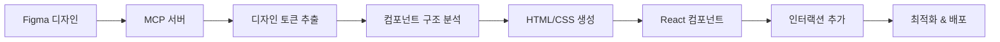

# 🎨 Figma 디자인 → 웹 코드 변환 가이드

Figma MCP를 활용하여 디자인을 실제 동작하는 웹 코드로 변환하는 완벽 가이드

## 📋 목차

1. [변환 워크플로우](#1-변환-워크플로우)
2. [디자인 토큰 추출](#2-디자인-토큰-추출)
3. [컴포넌트 생성](#3-컴포넌트-생성)
4. [스타일링 구현](#4-스타일링-구현)
5. [인터랙션 추가](#5-인터랙션-추가)
6. [최적화](#6-최적화)

---

## 1. 변환 워크플로우

### 전체 프로세스



### 단계별 작업

#### Step 1: Figma MCP 연결

```javascript
// Figma MCP 서버 연결
const figmaClient = new FigmaMCPClient(figma_token);
await figmaClient.connect();

// 문서 정보 확인
const docInfo = await figmaClient.getDocumentInfo();
console.log('Available frames:', docInfo.children);
```

#### Step 2: 디자인 스펙 추출

```javascript
// 디자인 토큰 추출
const tokens = await figmaClient.getDesignTokens(fileKey);

// CSS 변수 생성
const cssVars = generateCSSVariables(tokens);
```

#### Step 3: 컴포넌트 코드 생성

```javascript
// 컴포넌트 추출
const component = await figmaClient.exportComponent(
  fileKey,
  componentId,
  {
    format: 'react',
    framework: 'tailwind'
  }
);
```

---

## 2. 디자인 토큰 추출

### Figma MCP를 통한 토큰 추출

```javascript
/**
 * Figma에서 디자인 토큰 추출
 */

async function extractDesignTokens(fileKey) {
  const figma = new FigmaMCPClient(FIGMA_TOKEN);
  await figma.connect();
  
  // 색상, 타이포그래피, 간격 추출
  const tokens = await figma.call_tool('get_design_tokens', {
    file_key: fileKey,
    extract: ['colors', 'typography', 'spacing', 'effects']
  });
  
  return tokens;
}

// 사용 예시
const tokens = await extractDesignTokens('your_file_key');

// 결과:
{
  colors: {
    primary: { r: 0.26, g: 0.54, b: 0.98, a: 1 },
    success: { r: 0.13, g: 0.77, b: 0.49, a: 1 },
    // ...
  },
  typography: {
    h1: { fontSize: 36, fontWeight: 700, lineHeight: 1.2 },
    body: { fontSize: 14, fontWeight: 400, lineHeight: 1.5 },
    // ...
  },
  spacing: {
    xs: 4,
    sm: 8,
    md: 12,
    // ...
  }
}
```

### CSS 변수로 변환

```javascript
/**
 * 디자인 토큰을 CSS 변수로 변환
 */

function generateCSSVariables(tokens) {
  let css = ':root {\n';
  
  // 색상
  Object.entries(tokens.colors).forEach(([name, color]) => {
    const rgb = `${Math.round(color.r * 255)}, ${Math.round(color.g * 255)}, ${Math.round(color.b * 255)}`;
    css += `  --color-${name}: rgb(${rgb});\n`;
  });
  
  // 타이포그래피
  Object.entries(tokens.typography).forEach(([name, style]) => {
    css += `  --font-size-${name}: ${style.fontSize}px;\n`;
    css += `  --font-weight-${name}: ${style.fontWeight};\n`;
  });
  
  // 간격
  Object.entries(tokens.spacing).forEach(([name, value]) => {
    css += `  --spacing-${name}: ${value}px;\n`;
  });
  
  css += '}\n';
  return css;
}

// 결과
:root {
  --color-primary: rgb(67, 137, 250);
  --color-success: rgb(34, 197, 94);
  --font-size-h1: 36px;
  --font-weight-h1: 700;
  --spacing-xs: 4px;
  --spacing-sm: 8px;
  /* ... */
}
```

---

## 3. 컴포넌트 생성

### Figma → React 컴포넌트

#### 자동 변환

```javascript
/**
 * Figma 컴포넌트를 React 코드로 변환
 */

async function convertToReactComponent(fileKey, componentId) {
  const figma = new FigmaMCPClient(FIGMA_TOKEN);
  await figma.connect();
  
  // Figma 컴포넌트 정보 가져오기
  const componentData = await figma.call_tool('get_component', {
    file_key: fileKey,
    component_id: componentId
  });
  
  // React 코드 생성
  const reactCode = generateReactComponent(componentData);
  
  return reactCode;
}

function generateReactComponent(data) {
  const { name, props, children } = data;
  
  let code = `import React from 'react';\n\n`;
  code += `const ${name} = ({ ${props.join(', ')} }) => {\n`;
  code += `  return (\n`;
  code += generateJSX(children, 2);
  code += `  );\n`;
  code += `};\n\n`;
  code += `export default ${name};\n`;
  
  return code;
}
```

#### 예시: StatsCard 컴포넌트

**Figma 디자인:**
- Frame: 440x140px
- Background: #262C36
- Border Radius: 12px
- Padding: 24px
- Layout: Auto Layout (Vertical, gap 12px)

**생성된 React 코드:**

```jsx
import React from 'react';
import './StatsCard.css';

const StatsCard = ({ title, value, trend, icon, color = 'primary' }) => {
  return (
    <div className="stats-card">
      <div className="stats-card-header">
        <span className="stats-card-title">{title}</span>
        {icon && <span className={`stats-card-icon text-${color}`}>{icon}</span>}
      </div>
      <div className={`stats-card-value text-${color}`}>
        {value}
      </div>
      {trend && (
        <div className={`stats-card-trend ${trend === 'up' ? 'text-success' : 'text-danger'}`}>
          {trend === 'up' ? '↗' : '↘'} {trend === 'up' ? '상승' : '하락'}
        </div>
      )}
    </div>
  );
};

export default StatsCard;
```

**CSS:**

```css
.stats-card {
  background-color: var(--color-bg-darker);
  border-radius: 12px;
  padding: 24px;
  display: flex;
  flex-direction: column;
  gap: 12px;
  min-width: 440px;
  transition: transform 0.15s ease-in-out;
}

.stats-card:hover {
  transform: translateY(-2px);
}

.stats-card-value {
  font-size: 36px;
  font-weight: 700;
}
```

---

## 4. 스타일링 구현

### CSS-in-JS vs CSS Modules vs Tailwind

#### 1. CSS Variables (권장)

```css
/* designTokens.css - Figma에서 추출 */
:root {
  --color-primary: #4389FA;
  --spacing-md: 12px;
  --radius-lg: 12px;
}

/* Component.css */
.card {
  background: var(--color-bg-darker);
  padding: var(--spacing-2xl);
  border-radius: var(--radius-lg);
}
```

#### 2. Tailwind CSS (빠른 개발)

```jsx
// Figma 스타일을 Tailwind 클래스로 매핑
const styleMap = {
  'bg-darker': 'bg-gray-800',
  'text-primary': 'text-blue-500',
  'rounded-lg': 'rounded-xl',
  'p-2xl': 'p-6'
};

<div className="bg-gray-800 p-6 rounded-xl">
  {/* content */}
</div>
```

#### 3. Styled Components

```jsx
import styled from 'styled-components';

const StatsCard = styled.div`
  background-color: ${props => props.theme.colors.bgDarker};
  border-radius: ${props => props.theme.radius.lg};
  padding: ${props => props.theme.spacing['2xl']};
  
  &:hover {
    transform: translateY(-2px);
  }
`;
```

### 반응형 디자인 구현

```css
/* Mobile First Approach */

.stats-card {
  /* Mobile: 기본 스타일 */
  min-width: 100%;
  padding: var(--spacing-lg);
}

/* Tablet */
@media (min-width: 768px) {
  .stats-card {
    min-width: 300px;
  }
}

/* Desktop */
@media (min-width: 1024px) {
  .stats-card {
    min-width: 440px;
    padding: var(--spacing-2xl);
  }
}
```

---

## 5. 인터랙션 추가

### 애니메이션

#### CSS Transitions

```css
/* Figma의 Smart Animate를 CSS로 변환 */

.card {
  transition: all 0.25s ease-in-out;
}

.card:hover {
  transform: translateY(-2px);
  box-shadow: 0 10px 25px rgba(0, 0, 0, 0.2);
}
```

#### Framer Motion (고급)

```jsx
import { motion } from 'framer-motion';

const StatsCard = ({ title, value }) => {
  return (
    <motion.div
      className="stats-card"
      initial={{ opacity: 0, y: 20 }}
      animate={{ opacity: 1, y: 0 }}
      whileHover={{ y: -4, scale: 1.02 }}
      transition={{ duration: 0.2 }}
    >
      <h3>{title}</h3>
      <p>{value}</p>
    </motion.div>
  );
};
```

### 인터랙티브 요소

#### 버튼 상태

```jsx
const QuickTradeButton = () => {
  const [loading, setLoading] = useState(false);
  
  const handleClick = async () => {
    setLoading(true);
    await executeTrade();
    setLoading(false);
  };
  
  return (
    <button 
      className="quick-trade-btn"
      onClick={handleClick}
      disabled={loading}
    >
      {loading ? (
        <>
          <Spinner size={16} />
          <span>처리 중...</span>
        </>
      ) : (
        <>
          <Zap size={16} />
          <span>빠른거래</span>
        </>
      )}
    </button>
  );
};
```

#### 알림 토스트

```jsx
const NotificationToast = ({ type, message, onClose }) => {
  useEffect(() => {
    const timer = setTimeout(onClose, 5000);
    return () => clearTimeout(timer);
  }, []);
  
  const iconMap = {
    success: '✅',
    warning: '⚠️',
    error: '❌',
    info: 'ℹ️'
  };
  
  return (
    <motion.div
      className={`toast toast-${type}`}
      initial={{ x: 400, opacity: 0 }}
      animate={{ x: 0, opacity: 1 }}
      exit={{ x: 400, opacity: 0 }}
    >
      <span className="toast-icon">{iconMap[type]}</span>
      <p>{message}</p>
      <button onClick={onClose}>×</button>
    </motion.div>
  );
};
```

---

## 6. 최적화

### 성능 최적화

#### 1. 코드 스플리팅

```jsx
import { lazy, Suspense } from 'react';

// 필요할 때만 로드
const PriceChart = lazy(() => import('./components/PriceChart'));
const OrderBook = lazy(() => import('./components/OrderBook'));

function Dashboard() {
  return (
    <Suspense fallback={<LoadingSpinner />}>
      <PriceChart />
      <OrderBook />
    </Suspense>
  );
}
```

#### 2. 이미지 최적화

```jsx
// Lazy Loading


// Responsive Images
<picture>
  <source media="(min-width: 1024px)" srcSet="chart-desktop.webp" />
  <source media="(min-width: 768px)" srcSet="chart-tablet.webp" />
  
</picture>
```

#### 3. Virtual Scrolling

```jsx
import { FixedSizeList } from 'react-window';

const TradeHistory = ({ trades }) => {
  const Row = ({ index, style }) => (
    <div style={style}>
      {trades[index].ticker} - {trades[index].price}
    </div>
  );
  
  return (
    <FixedSizeList
      height={400}
      itemCount={trades.length}
      itemSize={48}
      width="100%"
    >
      {Row}
    </FixedSizeList>
  );
};
```

### 접근성 개선

#### ARIA 레이블

```jsx
<button
  className="notification-btn"
  aria-label="알림 보기"
  aria-describedby="notification-count"
>
  <Bell size={18} aria-hidden="true" />
  <span id="notification-count" className="sr-only">
    3개의 새 알림
  </span>
  <span className="notification-badge" aria-hidden="true">3</span>
</button>
```

#### 키보드 네비게이션

```jsx
const NavigationMenu = () => {
  const [activeIndex, setActiveIndex] = useState(0);
  
  const handleKeyDown = (e) => {
    if (e.key === 'ArrowRight') {
      setActiveIndex((prev) => (prev + 1) % menuItems.length);
    } else if (e.key === 'ArrowLeft') {
      setActiveIndex((prev) => (prev - 1 + menuItems.length) % menuItems.length);
    }
  };
  
  return (
    <div role="navigation" onKeyDown={handleKeyDown}>
      {menuItems.map((item, index) => (
        <button
          key={item.id}
          role="tab"
          aria-selected={index === activeIndex}
          tabIndex={index === activeIndex ? 0 : -1}
        >
          {item.label}
        </button>
      ))}
    </div>
  );
};
```

---

## 🎯 실전 예제: 완전한 변환 프로세스

### Step 1: Figma 디자인 분석

```javascript
// 1. Figma 문서 연결
const figma = new FigmaMCPClient(FIGMA_TOKEN);
await figma.connect();

// 2. 페이지 구조 확인
const doc = await figma.getDocumentInfo();
console.log('Pages:', doc.pages);

// 3. 대시보드 프레임 찾기
const dashboardFrame = doc.children.find(c => c.name.includes('Dashboard'));
```

### Step 2: 디자인 토큰 추출 및 저장

```javascript
// 토큰 추출
const tokens = await figma.getDesignTokens(fileKey);

// CSS 파일 생성
const cssVars = generateCSSVariables(tokens);
fs.writeFileSync('src/styles/designTokens.css', cssVars);
```

### Step 3: 컴포넌트 자동 생성

```javascript
// 주요 컴포넌트 목록
const components = [
  { id: 'stats-card', name: 'StatsCard' },
  { id: 'price-chart', name: 'PriceChart' },
  { id: 'orderbook', name: 'OrderBook' }
];

// 각 컴포넌트 코드 생성
for (const comp of components) {
  const code = await figma.exportComponent(fileKey, comp.id, {
    format: 'react',
    framework: 'css-modules'
  });
  
  fs.writeFileSync(`src/components/${comp.name}.jsx`, code);
}
```

### Step 4: 레이아웃 구성

```jsx
// 자동 생성된 레이아웃 코드
const DashboardLayout = () => {
  return (
    <div className="dashboard" style={{
      display: 'grid',
      gridTemplateColumns: '1fr 1fr 1fr',
      gap: '24px'
    }}>
      <StatsCard title="총 수익률" value="+15.8%" />
      <StatsCard title="오늘 수익" value="250,000 KRW" />
      <StatsCard title="오늘 거래" value="12 회" />
    </div>
  );
};
```

### Step 5: 데이터 연동

```jsx
import { useUpbitMCP } from './hooks/useUpbitMCP';

const Dashboard = () => {
  const { data, loading } = useUpbitMCP('KRW-BTC');
  
  if (loading) return <LoadingState />;
  
  return (
    <div>
      <StatsCard 
        title="BTC 가격"
        value={`${data.price.toLocaleString()} KRW`}
      />
    </div>
  );
};
```

---

## 📚 참고 자료

- [Figma MCP 공식 문서](https://modelcontextprotocol.io/)
- [React 공식 문서](https://react.dev/)
- [CSS Variables MDN](https://developer.mozilla.org/en-US/docs/Web/CSS/Using_CSS_custom_properties)
- [WCAG 접근성 가이드](https://www.w3.org/WAI/WCAG21/quickref/)

---

**🎨 Figma 디자인 → 💻 실제 코드**

Figma MCP를 활용하면 디자인과 개발 사이의 간극을 최소화하고, 
일관되고 유지보수하기 쉬운 코드를 생성할 수 있습니다!

